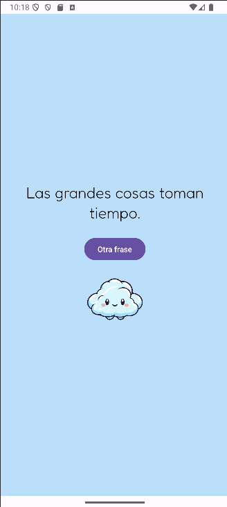

# Frases Motivacionales App

Esta es una aplicación móvil desarrollada en Kotlin para Android que presenta frases motivacionales aleatorias. El usuario puede ver nuevas frases presionando un botón, y cambiar el fondo de la app a uno de tres fondos animados con un simple clic. Además, el usuario puede configurar el color de fondo de la aplicación desde la pantalla de configuración.

## Funcionalidades:
- Ver frases motivacionales aleatorias.
- Cambiar el fondo de la app con imágenes predeterminadas.
- Configurar el color de fondo a gusto del usuario.

## Instrucciones de instalación y ejecución

1. Clona el repositorio en tu máquina local:

```bash
git clone https://github.com/TuUsuario/FrasesMotivacionalesApp.git
```
2. Abre el proyecto en Android Studio.
3. Asegúrate de tener Android SDK instalado y configurado.
4. Ejecuta la aplicación en un emulador o dispositivo físico.
5. Si deseas cambiar la configuración de colores de fondo, accede a la pantalla de configuración dentro de la app.

## Capturas de Pantalla



## Nuevas funcionalidades:
- 'Ver coleccion':
  - 'Ver frase': Ver frases aleatorias de la base de datos (store de firebase)
  - 'Gestionar colección': CRUD para la base de datos (store de firebase)
